# 📥 Creating a Scalable Data Ingestion Pipeline

<div align="center">


**📥 Learn Data Ingestion • 🔄 Build Pipelines • 📊 Process Real Data • 🚀 Automate Everything**

</div>

---

## 📖 Table of Contents

- [🌟 What is This Project?](#-what-is-this-project)
- [🎓 What You'll Learn](#-what-youll-learn)
- [📱 Our Use Case: E-commerce Order Processing](#-our-use-case-e-commerce-order-processing)
- [🏗️ Project Architecture](#️-project-architecture)
- [📁 Project Structure Explained](#-project-structure-explained)
- [🛠️ Setup Instructions](#️-setup-instructions)
- [🚀 Quick Start Guide](#-quick-start-guide)
- [📚 Step-by-Step Tutorials](#-step-by-step-tutorials)
- [🔄 Data Pipeline Walkthrough](#-data-pipeline-walkthrough)
- [📊 Data Sources Explained](#-data-sources-explained)
- [🧹 Data Processing Steps](#-data-processing-steps)
- [📈 Monitoring and Logging](#-monitoring-and-logging)
- [🧪 Testing Your Pipeline](#-testing-your-pipeline)
- [💡 Tips for Beginners](#-tips-for-beginners)
- [🔧 Troubleshooting](#-troubleshooting)
- [🎯 Next Steps](#-next-steps)

---

## 🌟 What is This Project?

This is a **beginner-friendly project** that teaches you how to build **data ingestion pipelines** from scratch. You'll learn to collect data from multiple sources, process it, and store it in a database - just like real companies do!

### 🎯 **Perfect for:**
- 👨‍💻 **Complete beginners** to data engineering
- 🎓 **Students** learning data processing
- 🚀 **Developers** wanting to understand data pipelines
- 🔬 **Anyone** curious about how data flows in companies

### 🆓 **Why This Project?**
- **100% Beginner-Friendly** - No complex tools to install
- **Real-World Example** - E-commerce order processing
- **Hands-On Learning** - Build actual working pipelines
- **Step-by-Step** - Every concept explained clearly
- **Immediate Results** - See your data flowing in real-time

### 🔄 **What is Data Ingestion?**
**Data Ingestion** is the process of collecting data from various sources and bringing it into your system for processing and analysis. Think of it like a **digital conveyor belt** that automatically collects, cleans, and organizes data!

---

## 🎓 What You'll Learn

By completing this project, you'll master:

| 📚 **Data Engineering Concept** | 🎯 **What You'll Master** | 🛠️ **Tools Used** |
|--------------------------------|---------------------------|-------------------|
| **📥 Data Collection** | Reading files, calling APIs, database queries | Python, Pandas, Requests |
| **🔍 Data Validation** | Checking data quality and completeness | Custom validators |
| **🧹 Data Transformation** | Cleaning, formatting, and enriching data | Pandas, Python |
| **💾 Data Storage** | Saving processed data to databases | SQLite, SQL |
| **⏰ Automation** | Scheduling and running jobs automatically | Python Schedule |
| **📊 Monitoring** | Tracking pipeline health and performance | Python Logging |
| **⚠️ Error Handling** | Managing failures and retries gracefully | Try-catch, logging |
| **🔧 Pipeline Design** | Building scalable and maintainable systems | Design patterns |

---

## 📱 Our Use Case: E-commerce Order Processing

We'll build a data ingestion pipeline for **"TechStore"** - a fictional online electronics store that needs to collect and process orders from multiple sources.

### 🏪 **Business Scenario:**
TechStore receives orders from:
- 📁 **CSV Files** - Daily sales reports from physical stores
- 🌐 **REST API** - Online website orders
- 📄 **JSON Files** - Mobile app orders
- 🗄️ **Database** - Partner store orders

### 🎯 **What We Need to Do:**
1. **Collect** orders from all sources automatically
2. **Validate** that order data is complete and correct
3. **Transform** data into a standard format
4. **Store** processed orders in a central database
5. **Monitor** the pipeline for issues
6. **Generate** daily reports for the business team

### 📊 **Sample Data We'll Process:**
```json
{
  "order_id": "ORD-2024-001",
  "customer_name": "John Doe",
  "product": "iPhone 15",
  "quantity": 1,
  "price": 999.99,
  "order_date": "2024-01-15",
  "source": "website"
}
```

---

## 🏗️ Project Architecture

Our data ingestion pipeline follows a simple, scalable architecture:

```mermaid
graph TD
    A[📁 CSV Files] --> E[🔄 Data Ingestion Pipeline]
    B[🌐 REST API] --> E
    C[📄 JSON Files] --> E
    D[🗄️ Database] --> E
    
    E --> F[🔍 Data Validation]
    F --> G[🧹 Data Transformation]
    G --> H[💾 Data Storage]
    H --> I[📊 Reports & Analytics]
    
    J[📈 Monitoring] --> E
    K[⏰ Scheduler] --> E
```



### 🔄 **Pipeline Flow:**
1. **📥 Data Sources** → Various input sources (files, APIs, databases)
2. **🔄 Ingestion Layer** → Collectors that gather data from sources
3. **🔍 Validation Layer** → Checks data quality and completeness
4. **🧹 Transformation Layer** → Cleans and standardizes data
5. **💾 Storage Layer** → Saves processed data to database
6. **📊 Output Layer** → Reports and analytics
7. **📈 Monitoring Layer** → Tracks pipeline health and performance

---

## 📁 Project Structure Explained

Let's understand every file and folder in our data ingestion project:

```
📦 Creating-a-Scalable-Data-Ingestion/
├── 📄 README.md                    # 👈 You are here! Complete documentation
├── 📄 requirements.txt             # 📦 Python packages we need
├── 📄 setup.py                     # 🛠️ Project installation script
├── 📄 .gitignore                   # 🚫 Files Git should ignore
│
├── 📁 data/                        # 📊 All data files and database
│   ├── 📁 input/                  # 📥 Incoming data files
│   │   ├── 📁 csv/                # 📊 CSV files from stores
│   │   ├── 📁 json/               # 📄 JSON files from mobile app
│   │   └── 📁 processed/          # ✅ Successfully processed files
│   ├── 📁 output/                 # 📤 Generated reports
│   ├── 📁 samples/                # 📋 Example data for learning
│   └── 📄 orders.db               # 🗄️ SQLite database
│
├── 📁 src/                         # 💻 All source code
│   ├── 📄 __init__.py             # 🐍 Python package marker
│   ├── 📁 ingestion/              # 📥 Data collection modules
│   │   ├── 📄 __init__.py
│   │   ├── 📄 file_ingestion.py   # 📁 Read CSV and JSON files
│   │   ├── 📄 api_ingestion.py    # 🌐 Call REST APIs
│   │   └── 📄 database_ingestion.py # 🗄️ Query databases
│   │
│   ├── 📁 validation/             # 🔍 Data quality checks
│   │   ├── 📄 __init__.py
│   │   ├── 📄 data_validator.py   # ✅ Validate data quality
│   │   └── 📄 schema_validator.py # 📋 Check data structure
│   │
│   ├── 📁 transformation/         # 🧹 Data processing
│   │   ├── 📄 __init__.py
│   │   ├── 📄 data_cleaner.py     # 🧽 Clean messy data
│   │   ├── 📄 data_enricher.py    # ➕ Add calculated fields
│   │   └── 📄 data_standardizer.py # 📏 Standardize formats
│   │
│   ├── 📁 storage/                # 💾 Data storage
│   │   ├── 📄 __init__.py
│   │   ├── 📄 database_manager.py # 🗄️ Database operations
│   │   └── 📄 file_manager.py     # 📁 File operations
│   │
│   ├── 📁 monitoring/             # 📈 Pipeline monitoring
│   │   ├── 📄 __init__.py
│   │   ├── 📄 logger.py           # 📝 Logging system
│   │   ├── 📄 metrics.py          # 📊 Performance metrics
│   │   └── 📄 alerting.py         # 🚨 Alert system
│   │
│   ├── 📁 pipeline/               # 🔄 Pipeline orchestration
│   │   ├── 📄 __init__.py
│   │   ├── 📄 pipeline_manager.py # 🎯 Main pipeline controller
│   │   └── 📄 scheduler.py        # ⏰ Job scheduling
│   │
│   └── 📁 utils/                  # 🛠️ Utility functions
│       ├── 📄 __init__.py
│       ├── 📄 config.py           # ⚙️ Configuration settings
│       ├── 📄 helpers.py          # 🔧 Helper functions
│       └── 📄 constants.py        # 📋 Constants and enums
│
├── 📁 config/                      # ⚙️ Configuration files
│   ├── 📄 pipeline_config.yaml    # 🔄 Pipeline settings
│   ├── 📄 database_config.yaml    # 🗄️ Database settings
│   └── 📄 api_config.yaml         # 🌐 API endpoints
│
├── 📁 scripts/                     # 🔧 Utility scripts
│   ├── 📄 setup_database.py       # 🗄️ Initialize database
│   ├── 📄 generate_sample_data.py # 📊 Create test data
│   ├── 📄 run_pipeline.py         # 🚀 Run the pipeline
│   └── 📄 health_check.py         # ❤️ Check system health
│
├── 📁 tests/                       # 🧪 Testing suite
│   ├── 📄 __init__.py
│   ├── 📄 test_ingestion.py       # 📥 Test data collection
│   ├── 📄 test_validation.py      # 🔍 Test data validation
│   ├── 📄 test_transformation.py  # 🧹 Test data processing
│   └── 📄 test_pipeline.py        # 🔄 Test complete pipeline
│
├── 📁 notebooks/                   # 📚 Learning tutorials
│   ├── 📄 01_understanding_data_ingestion.ipynb    # 📖 What is data ingestion?
│   ├── 📄 02_reading_files.ipynb                   # 📁 How to read CSV/JSON
│   ├── 📄 03_calling_apis.ipynb                    # 🌐 How to call APIs
│   ├── 📄 04_data_validation.ipynb                 # 🔍 Ensuring data quality
│   ├── 📄 05_data_transformation.ipynb             # 🧹 Cleaning and processing
│   ├── 📄 06_building_pipeline.ipynb               # 🔄 Complete pipeline
│   └── 📄 07_monitoring_pipeline.ipynb             # 📈 Monitoring and alerts
│
├── 📁 docs/                        # 📚 Additional documentation
│   ├── 📄 architecture.md         # 🏗️ System architecture
│   ├── 📄 api_reference.md        # 📖 API documentation
│   ├── 📄 troubleshooting.md      # 🔧 Common issues
│   └── 📄 best_practices.md       # 💡 Best practices
│
└── 📁 logs/                        # 📝 Log files
    ├── 📄 pipeline.log            # 🔄 Pipeline execution logs
    ├── 📄 errors.log              # ❌ Error logs
    └── 📄 metrics.log             # 📊 Performance metrics
```

### 🔍 **Key Components Explained:**

#### 📥 **Ingestion Layer (`src/ingestion/`)**
- **File Ingestion**: Monitors folders for new CSV/JSON files with automatic encoding detection
- **API Ingestion**: Polls REST APIs with rate limiting and retry logic
- **Smart Detection**: Automatically detects new data sources and formats
- **Error Handling**: Graceful handling of corrupted files and API failures

#### 🔍 **Validation Layer (`src/validation/`) - NEW!**
- **Data Quality Validation**: Comprehensive quality scoring (0-100%)
- **Schema Validation**: Field-level validation with custom rules
- **Business Rules**: Order validation, price checks, date validation
- **Quality Reporting**: Detailed validation reports with error categorization

#### 🧹 **Transformation Layer (`src/transformation/`) - NEW!**
- **Data Cleaning**: Deduplication, missing value handling, format fixing
- **Data Enrichment**: Customer segmentation, business metrics, seasonal factors
- **Data Standardization**: Consistent formats, phone numbers, emails, addresses
- **Quality Scoring**: Individual record quality assessment

#### 💾 **Storage Layer (`src/storage/`) - NEW!**
- **Database Management**: Full CRUD operations with batch processing
- **File Management**: Export, archiving, backup, and cleanup operations
- **Performance Optimization**: Database indexing and query optimization
- **Storage Analytics**: Comprehensive storage usage reporting

#### 🎯 **Pipeline Orchestration (`src/pipeline/`) - NEW!**
- **Pipeline Manager**: Complete workflow orchestration
- **Stage Coordination**: Automatic flow between ingestion → validation → transformation → storage
- **Error Recovery**: Graceful failure handling and stage-level recovery
- **Performance Monitoring**: Execution time tracking and bottleneck identification

#### 📈 **Monitoring & Reporting - ENHANCED!**
- **Structured Logging**: Comprehensive activity tracking with metrics
- **Pipeline Reports**: Detailed execution reports with stage-by-stage analysis
- **Health Monitoring**: System health checks and status reporting
- **Performance Metrics**: Throughput, success rates, and quality trends

---

## 🛠️ Setup Instructions

### 📋 **Prerequisites:**
- 🐍 **Python 3.8 or higher** ([Download here](https://python.org))
- 💻 **Command line/Terminal access**
- 📝 **Text editor** (VS Code, PyCharm, or any editor)
- 🌐 **Internet connection** (for API calls)

### 🚀 **Step 1: Clone the Repository**
```bash
# Download the project
git clone https://github.com/Amruth22/Creating-a-Scalable-Data-Ingestion.git

# Enter the project folder
cd Creating-a-Scalable-Data-Ingestion
```

### 🏠 **Step 2: Create Virtual Environment**
```bash
# Create virtual environment (highly recommended!)
python -m venv data_ingestion_env

# Activate it:
# On Windows:
data_ingestion_env\Scripts\activate

# On Mac/Linux:
source data_ingestion_env/bin/activate

# You should see (data_ingestion_env) in your terminal!
```

> 💡 **Why virtual environment?** It keeps this project's packages separate from your other Python projects and prevents conflicts!

### 📦 **Step 3: Install Dependencies**
```bash
# Install all required packages
pip install -r requirements.txt

# This installs:
# - pandas (data processing)
# - requests (API calls)
# - schedule (job scheduling)
# - sqlite3 (database - built into Python)
# - pyyaml (configuration files)
# - jupyter (interactive notebooks)
```

### 🗄️ **Step 4: Initialize Database**
```bash
# Set up the SQLite database
python scripts/setup_database.py

# Generate sample data for learning
python scripts/generate_sample_data.py
```

### ✅ **Step 5: Verify Installation**
```bash
# Run health check
python scripts/health_check.py

# You should see:
# ✅ Database connection: OK
# ✅ Sample data: OK
# ✅ Configuration: OK
# ✅ All systems ready!
```

---

## 🚀 Quick Start Guide

### 🎯 **Option 1: Run Complete Pipeline**
```bash
# Execute the full data ingestion pipeline
python scripts/run_pipeline.py

# This will:
# 1. 📥 Collect data from all sources
# 2. 🔍 Validate data quality
# 3. 🧹 Clean and transform data
# 4. 💾 Store in database
# 5. 📊 Generate reports
# 6. 📝 Log all activities
```

### 📚 **Option 2: Follow Interactive Tutorials**
```bash
# Start Jupyter notebook server
jupyter notebook

# Open tutorials in order:
# 1. notebooks/01_understanding_data_ingestion.ipynb
# 2. notebooks/02_reading_files.ipynb
# 3. notebooks/03_calling_apis.ipynb
# 4. notebooks/04_data_validation.ipynb
# 5. notebooks/05_data_transformation.ipynb
# 6. notebooks/06_building_pipeline.ipynb
# 7. notebooks/07_monitoring_pipeline.ipynb
```

### 🧪 **Option 3: Test Individual Components**
```bash
# Test file ingestion
python -m src.ingestion.file_ingestion

# Test API ingestion
python -m src.ingestion.api_ingestion

# Test data validation
python -m src.validation.data_validator

# Test data transformation
python -m src.transformation.data_cleaner

# Test database operations
python -m src.storage.database_manager

# Test complete pipeline
python -m src.pipeline.pipeline_manager

# Run all tests
python -m pytest tests/ -v
```

---

## 📚 Step-by-Step Tutorials

Our project includes comprehensive Jupyter notebook tutorials that guide you through each concept:

### 📖 **Tutorial Sequence:**

#### 📊 **1. Understanding Data Ingestion (`01_understanding_data_ingestion.ipynb`)**
- What is data ingestion and why it matters
- Real-world examples and use cases
- Different types of data sources
- Common challenges and solutions

#### 📁 **2. Reading Files (`02_reading_files.ipynb`)**
- How to read CSV files with pandas
- Processing JSON files
- Handling different file formats
- File monitoring and automation

#### 🌐 **3. Calling APIs (`03_calling_apis.ipynb`)**
- Understanding REST APIs
- Making HTTP requests with Python
- Handling API responses and errors
- Authentication and rate limiting

#### 🔍 **4. Data Validation (`04_data_validation.ipynb`)**
- Why data validation is crucial
- Common data quality issues
- Building validation rules
- Handling validation failures

#### 🧹 **5. Data Transformation (`05_data_transformation.ipynb`)**
- Cleaning messy data
- Standardizing formats
- Enriching data with calculations
- Handling missing values

#### 🔄 **6. Building Pipeline (`06_building_pipeline.ipynb`)**
- Connecting all components
- Error handling and retries
- Performance optimization
- Testing your pipeline

#### 📈 **7. Monitoring Pipeline (`07_monitoring_pipeline.ipynb`)**
- Setting up logging
- Creating metrics and alerts
- Building dashboards
- Troubleshooting issues

### 🎯 **How to Use Tutorials:**
```bash
# Start Jupyter
jupyter notebook

# Navigate to notebooks/ folder
# Open tutorials in order (01, 02, 03, etc.)
# Run cells step by step
# Experiment with different parameters
# Complete the exercises at the end
```

---

## 🔄 Data Pipeline Walkthrough

Let's walk through our complete data ingestion pipeline step by step:

### 📥 **Stage 1: Data Collection**
```python
# File Ingestion Example
from src.ingestion.file_ingestion import FileIngestion

ingestion = FileIngestion()

# Monitor folder for new CSV files
csv_data = ingestion.process_csv_files('data/input/csv/')

# Process JSON files from mobile app
json_data = ingestion.process_json_files('data/input/json/')

print(f"Collected {len(csv_data)} CSV records")
print(f"Collected {len(json_data)} JSON records")
```

### 🔍 **Stage 2: Data Validation**
```python
# Data Validation Example
from src.validation.data_validator import DataValidator
from src.validation.schema_validator import SchemaValidator

# Data quality validation
data_validator = DataValidator()
validation_result = data_validator.validate_orders(csv_data)

print(f"Quality Score: {validation_result.quality_score:.1f}%")
print(f"Valid Records: {validation_result.valid_records}/{validation_result.total_records}")

# Schema validation
schema_validator = SchemaValidator()
schema_result = schema_validator.validate_schema(csv_data, 'orders')

print(f"Schema Valid: {schema_result.is_valid}")
print(f"Valid Fields: {schema_result.valid_fields}/{schema_result.total_fields}")
```

### 🧹 **Stage 3: Data Transformation**
```python
# Data Transformation Example
from src.transformation.data_cleaner import DataCleaner
from src.transformation.data_enricher import DataEnricher
from src.transformation.data_standardizer import DataStandardizer

# Clean data
cleaner = DataCleaner()
cleaning_result = cleaner.clean_orders(csv_data)
print(f"Cleaned: {cleaning_result.cleaned_records}/{cleaning_result.original_records} records")

# Enrich data
enricher = DataEnricher()
enrichment_result = enricher.enrich_orders(cleaning_result.data)
print(f"Enriched: {enrichment_result.added_fields} fields added")

# Standardize data
standardizer = DataStandardizer()
standardization_result = standardizer.standardize_orders(enrichment_result.data)
print(f"Standardized: {standardization_result.fields_standardized} fields")
```

### 💾 **Stage 4: Data Storage**
```python
# Data Storage Example
from src.storage.database_manager import DatabaseManager
from src.storage.file_manager import FileManager

# Database storage
db_manager = DatabaseManager()
db_result = db_manager.save_orders(processed_data)
print(f"Database: {db_result.records_affected} records saved")

# File storage and export
file_manager = FileManager()
export_result = file_manager.export_data_summary(processed_data, "daily_export")
print(f"Files: {export_result.files_affected} files created")

# Get database statistics
stats_result = db_manager.get_database_stats()
if stats_result.success:
    stats = stats_result.data.iloc[0]
    print(f"Total orders in DB: {stats['orders_count']}")
```

### 📊 **Stage 5: Pipeline Orchestration**
```python
# Complete Pipeline Execution
from src.pipeline.pipeline_manager import PipelineManager

# Initialize and run pipeline
pipeline = PipelineManager("production_pipeline")
result = pipeline.run_pipeline()

print(f"Pipeline Status: {'✅ SUCCESS' if result.success else '❌ FAILED'}")
print(f"Records Processed: {result.total_records_processed:,}")
print(f"Execution Time: {result.execution_time:.2f}s")
print(f"Stages Completed: {', '.join(result.stages_completed)}")

# Generate comprehensive report
report = pipeline.generate_pipeline_report(result)
print(f"Report generated: {len(report)} characters")
```

---

## 📊 Data Sources Explained

Our pipeline handles multiple data sources that are common in real businesses:

### 📁 **1. CSV Files (Store Sales Data)**
**Source**: Physical store point-of-sale systems  
**Format**: Comma-separated values  
**Frequency**: Daily uploads  

**Sample CSV Structure:**
```csv
order_id,customer_name,product,quantity,price,order_date,store_location
ORD-001,John Doe,iPhone 15,1,999.99,2024-01-15,New York
ORD-002,Jane Smith,MacBook Pro,1,1999.99,2024-01-15,Los Angeles
```

**Processing Steps:**
1. Monitor `data/input/csv/` folder for new files
2. Read CSV with pandas
3. Validate column structure
4. Check for missing values
5. Move processed files to `data/input/processed/`

### 🌐 **2. REST API (Website Orders)**
**Source**: E-commerce website  
**Format**: JSON over HTTP  
**Frequency**: Real-time polling every 5 minutes  

**Sample API Response:**
```json
{
  "orders": [
    {
      "order_id": "WEB-001",
      "customer_name": "Alice Johnson",
      "product": "iPad Air",
      "quantity": 2,
      "price": 599.99,
      "order_date": "2024-01-15T10:30:00Z",
      "source": "website"
    }
  ],
  "total_count": 1,
  "has_more": false
}
```

**Processing Steps:**
1. Make HTTP GET request to API endpoint
2. Handle authentication if required
3. Parse JSON response
4. Extract order data
5. Handle pagination for large datasets

### 📄 **3. JSON Files (Mobile App Orders)**
**Source**: Mobile application  
**Format**: JSON files  
**Frequency**: Hourly batch uploads  

**Sample JSON Structure:**
```json
{
  "app_version": "2.1.0",
  "upload_time": "2024-01-15T12:00:00Z",
  "orders": [
    {
      "order_id": "APP-001",
      "customer_name": "Bob Wilson",
      "product": "AirPods Pro",
      "quantity": 1,
      "price": 249.99,
      "order_date": "2024-01-15T11:45:00Z",
      "device_type": "iOS"
    }
  ]
}
```

**Processing Steps:**
1. Monitor `data/input/json/` folder
2. Parse JSON files
3. Extract nested order data
4. Validate JSON schema
5. Archive processed files

### 🗄️ **4. Database Queries (Partner Orders)**
**Source**: Partner store database  
**Format**: SQL query results  
**Frequency**: Every 2 hours  

**Sample Database Schema:**
```sql
CREATE TABLE partner_orders (
    id INTEGER PRIMARY KEY,
    order_reference VARCHAR(50),
    customer_email VARCHAR(100),
    product_sku VARCHAR(50),
    quantity INTEGER,
    unit_price DECIMAL(10,2),
    created_at TIMESTAMP,
    partner_id VARCHAR(20)
);
```

**Processing Steps:**
1. Connect to partner database
2. Execute SQL query for new orders
3. Convert results to pandas DataFrame
4. Apply data transformations
5. Track last processed timestamp

---

## 🧹 Data Processing Steps

Our pipeline applies several processing steps to ensure data quality and consistency:

### 🔍 **1. Data Validation**

#### **Schema Validation:**
```python
# Check required fields
required_fields = ['order_id', 'customer_name', 'product', 'quantity', 'price', 'order_date']

def validate_schema(data):
    missing_fields = []
    for field in required_fields:
        if field not in data.columns:
            missing_fields.append(field)
    
    return {
        'is_valid': len(missing_fields) == 0,
        'missing_fields': missing_fields
    }
```

#### **Data Quality Checks:**
```python
def validate_data_quality(data):
    issues = []
    
    # Check for missing values
    if data['customer_name'].isnull().any():
        issues.append("Missing customer names found")
    
    # Check for negative quantities
    if (data['quantity'] < 0).any():
        issues.append("Negative quantities found")
    
    # Check for invalid prices
    if (data['price'] <= 0).any():
        issues.append("Invalid prices found")
    
    return {
        'is_valid': len(issues) == 0,
        'issues': issues
    }
```

### 🧽 **2. Data Cleaning**

#### **Remove Duplicates:**
```python
def remove_duplicates(data):
    # Remove exact duplicates
    data_clean = data.drop_duplicates()
    
    # Remove duplicates based on order_id
    data_clean = data_clean.drop_duplicates(subset=['order_id'])
    
    return data_clean
```

#### **Fix Data Types:**
```python
def fix_data_types(data):
    # Convert dates
    data['order_date'] = pd.to_datetime(data['order_date'])
    
    # Convert numeric fields
    data['quantity'] = pd.to_numeric(data['quantity'], errors='coerce')
    data['price'] = pd.to_numeric(data['price'], errors='coerce')
    
    # Clean text fields
    data['customer_name'] = data['customer_name'].str.strip().str.title()
    data['product'] = data['product'].str.strip()
    
    return data
```

#### **Handle Missing Values:**
```python
def handle_missing_values(data):
    # Fill missing customer names with "Unknown"
    data['customer_name'].fillna('Unknown Customer', inplace=True)
    
    # Fill missing quantities with 1
    data['quantity'].fillna(1, inplace=True)
    
    # Remove rows with missing critical fields
    data = data.dropna(subset=['order_id', 'product', 'price'])
    
    return data
```

### ➕ **3. Data Enrichment**

#### **Add Calculated Fields:**
```python
def enrich_data(data):
    # Calculate total amount
    data['total_amount'] = data['quantity'] * data['price']
    
    # Add processing timestamp
    data['processed_at'] = pd.Timestamp.now()
    
    # Extract date components
    data['order_year'] = data['order_date'].dt.year
    data['order_month'] = data['order_date'].dt.month
    data['order_day'] = data['order_date'].dt.day
    data['order_weekday'] = data['order_date'].dt.day_name()
    
    # Categorize order size
    data['order_size'] = pd.cut(data['total_amount'], 
                               bins=[0, 100, 500, 1000, float('inf')],
                               labels=['Small', 'Medium', 'Large', 'XLarge'])
    
    return data
```

### 📏 **4. Data Standardization**

#### **Standardize Formats:**
```python
def standardize_data(data):
    # Standardize order ID format
    data['order_id'] = data['order_id'].str.upper()
    
    # Standardize product names
    product_mapping = {
        'iphone 15': 'iPhone 15',
        'macbook pro': 'MacBook Pro',
        'ipad air': 'iPad Air',
        'airpods pro': 'AirPods Pro'
    }
    data['product'] = data['product'].str.lower().map(product_mapping).fillna(data['product'])
    
    # Standardize source field
    data['source'] = data['source'].str.lower()
    
    return data
```

---

## 📈 Monitoring and Logging

Our pipeline includes comprehensive monitoring to track performance and catch issues early:

### 📝 **Logging System**

#### **Log Levels:**
```python
import logging

# Configure logging
logging.basicConfig(
    level=logging.INFO,
    format='%(asctime)s - %(name)s - %(levelname)s - %(message)s',
    handlers=[
        logging.FileHandler('logs/pipeline.log'),
        logging.StreamHandler()
    ]
)

logger = logging.getLogger(__name__)

# Usage examples:
logger.info("Pipeline started successfully")
logger.warning("API response time is slow")
logger.error("Failed to connect to database")
```

#### **Structured Logging:**
```python
def log_pipeline_metrics(stage, records_processed, processing_time, errors):
    log_entry = {
        'timestamp': pd.Timestamp.now().isoformat(),
        'stage': stage,
        'records_processed': records_processed,
        'processing_time_seconds': processing_time,
        'errors_count': len(errors),
        'success_rate': (records_processed - len(errors)) / records_processed if records_processed > 0 else 0
    }
    
    logger.info(f"Pipeline metrics: {log_entry}")
```

### 📊 **Performance Metrics**

#### **Key Metrics We Track:**
```python
class PipelineMetrics:
    def __init__(self):
        self.metrics = {
            'records_processed': 0,
            'processing_time': 0,
            'error_count': 0,
            'success_rate': 0,
            'throughput_per_minute': 0,
            'data_quality_score': 0
        }
    
    def calculate_throughput(self, records, time_seconds):
        return (records / time_seconds) * 60 if time_seconds > 0 else 0
    
    def calculate_success_rate(self, total, errors):
        return ((total - errors) / total) * 100 if total > 0 else 0
```

### 🚨 **Alerting System**

#### **Email Alerts:**
```python
def send_alert(subject, message, alert_type='info'):
    """Send email alert for important events"""
    
    if alert_type == 'error':
        # Send immediate alert for errors
        send_email(
            to='admin@techstore.com',
            subject=f"🚨 URGENT: {subject}",
            body=message
        )
    elif alert_type == 'warning':
        # Send warning for performance issues
        send_email(
            to='team@techstore.com',
            subject=f"⚠️ WARNING: {subject}",
            body=message
        )
```

#### **Alert Conditions:**
```python
def check_alert_conditions(metrics):
    alerts = []
    
    # Error rate too high
    if metrics['error_count'] > 10:
        alerts.append({
            'type': 'error',
            'message': f"High error count: {metrics['error_count']} errors"
        })
    
    # Processing time too slow
    if metrics['processing_time'] > 300:  # 5 minutes
        alerts.append({
            'type': 'warning',
            'message': f"Slow processing: {metrics['processing_time']} seconds"
        })
    
    # Success rate too low
    if metrics['success_rate'] < 95:
        alerts.append({
            'type': 'warning',
            'message': f"Low success rate: {metrics['success_rate']}%"
        })
    
    return alerts
```

### 📊 **Dashboard Metrics**

#### **Real-time Dashboard:**
```python
def generate_dashboard_data():
    """Generate data for monitoring dashboard"""
    
    # Get recent pipeline runs
    recent_runs = get_recent_pipeline_runs(hours=24)
    
    dashboard_data = {
        'total_records_today': sum(run['records_processed'] for run in recent_runs),
        'average_processing_time': np.mean([run['processing_time'] for run in recent_runs]),
        'success_rate_24h': calculate_success_rate_24h(),
        'current_throughput': calculate_current_throughput(),
        'active_alerts': get_active_alerts(),
        'data_sources_status': check_data_sources_health()
    }
    
    return dashboard_data
```

---

## 🧪 Testing Your Pipeline

Testing is crucial for reliable data pipelines. Our project includes comprehensive tests for all components:

### 🎯 **Available Test Suites:**
- **Unit Tests**: Individual component testing
- **Integration Tests**: End-to-end pipeline testing
- **Data Quality Tests**: Validation and transformation testing
- **Performance Tests**: Load and stress testing

### 🔧 **Unit Tests**

#### **Test Data Validation:**
```python
# tests/test_validation.py
import unittest
from src.validation.data_validator import DataValidator

class TestDataValidator(unittest.TestCase):
    def setUp(self):
        self.validator = DataValidator()
        self.sample_data = pd.DataFrame({
            'order_id': ['ORD-001', 'ORD-002'],
            'customer_name': ['John Doe', 'Jane Smith'],
            'product': ['iPhone 15', 'MacBook Pro'],
            'quantity': [1, 1],
            'price': [999.99, 1999.99],
            'order_date': ['2024-01-15', '2024-01-15']
        })
    
    def test_valid_data(self):
        result = self.validator.validate_orders(self.sample_data)
        self.assertTrue(result['is_valid'])
    
    def test_missing_required_field(self):
        invalid_data = self.sample_data.drop('order_id', axis=1)
        result = self.validator.validate_orders(invalid_data)
        self.assertFalse(result['is_valid'])
        self.assertIn('order_id', result['missing_fields'])
```

#### **Test Data Transformation:**
```python
# tests/test_transformation.py
import unittest
from src.transformation.data_cleaner import DataCleaner

class TestDataCleaner(unittest.TestCase):
    def setUp(self):
        self.cleaner = DataCleaner()
    
    def test_remove_duplicates(self):
        # Test data with duplicates
        data_with_duplicates = pd.DataFrame({
            'order_id': ['ORD-001', 'ORD-001', 'ORD-002'],
            'customer_name': ['John', 'John', 'Jane'],
            'product': ['iPhone', 'iPhone', 'MacBook']
        })
        
        cleaned_data = self.cleaner.remove_duplicates(data_with_duplicates)
        self.assertEqual(len(cleaned_data), 2)  # Should remove 1 duplicate
    
    def test_fix_data_types(self):
        # Test data type conversion
        data = pd.DataFrame({
            'quantity': ['1', '2', '3'],  # String numbers
            'price': ['99.99', '199.99', '299.99']  # String prices
        })
        
        fixed_data = self.cleaner.fix_data_types(data)
        self.assertEqual(fixed_data['quantity'].dtype, 'int64')
        self.assertEqual(fixed_data['price'].dtype, 'float64')
```

### 🔄 **Integration Tests**

#### **Test Complete Pipeline:**
```python
# tests/test_pipeline.py
import unittest
from src.pipeline.pipeline_manager import PipelineManager

class TestPipeline(unittest.TestCase):
    def setUp(self):
        self.pipeline = PipelineManager()
    
    def test_end_to_end_pipeline(self):
        # Test complete pipeline with sample data
        result = self.pipeline.run_pipeline(test_mode=True)
        
        self.assertTrue(result['success'])
        self.assertGreater(result['records_processed'], 0)
        self.assertEqual(result['error_count'], 0)
    
    def test_pipeline_with_invalid_data(self):
        # Test pipeline handles invalid data gracefully
        result = self.pipeline.run_pipeline(
            test_mode=True, 
            use_invalid_data=True
        )
        
        self.assertTrue(result['success'])  # Should still succeed
        self.assertGreater(result['error_count'], 0)  # But with errors logged
```

### 🚀 **Running Tests**

```bash
# Run all tests
python -m pytest tests/ -v

# Run specific test categories
python -m pytest tests/test_validation.py -v      # Validation tests
python -m pytest tests/test_transformation.py -v # Transformation tests
python -m pytest tests/test_storage.py -v        # Storage tests
python -m pytest tests/test_pipeline.py -v       # Pipeline tests

# Run tests with coverage
python -m pytest tests/ --cov=src --cov-report=html

# Run tests and generate report
python -m pytest tests/ --html=test_report.html

# Run performance tests
python -m pytest tests/test_performance.py -v
```

### 📊 **Test Coverage**

```bash
# Generate coverage report
coverage run -m pytest tests/
coverage report
coverage html

# View HTML report
open htmlcov/index.html
```

---

## 💡 Tips for Beginners

### 🎯 **Getting Started:**

1. **📚 Start with Notebooks**
   ```
   Begin with Jupyter tutorials:
   - 01_understanding_data_ingestion.ipynb (learn concepts)
   - 02_reading_files.ipynb (hands-on file processing)
   - 03_calling_apis.ipynb (API integration)
   ```

2. **🔍 Understand Your Data First**
   ```python
   # Always explore before processing
   data.info()                    # Data types and missing values
   data.describe()                # Statistical summary
   data.head()                    # First few rows
   data.sample(10)                # Random sample
   ```

3. **🧪 Test with Small Data**
   ```python
   # Start with small datasets
   sample_data = data.head(100)   # Use first 100 rows
   
   # Test your pipeline
   result = process_data(sample_data)
   print(f"Processed {len(result)} records")
   ```

### 🔧 **Development Best Practices:**

1. **📝 Log Everything**
   ```python
   import logging
   logger = logging.getLogger(__name__)
   
   # Log important events
   logger.info(f"Processing {len(data)} records")
   logger.warning(f"Found {error_count} errors")
   logger.error(f"Failed to process file: {filename}")
   ```

2. **⚠️ Handle Errors Gracefully**
   ```python
   try:
       result = process_data(data)
   except Exception as e:
       logger.error(f"Processing failed: {e}")
       # Don't crash - handle the error
       result = handle_error(data, e)
   ```

3. **🔄 Make It Resumable**
   ```python
   # Track progress
   def process_files(file_list):
       for i, file in enumerate(file_list):
           logger.info(f"Processing file {i+1}/{len(file_list)}: {file}")
           try:
               process_file(file)
               mark_as_processed(file)
           except Exception as e:
               logger.error(f"Failed to process {file}: {e}")
               continue  # Skip to next file
   ```

### 🚀 **Performance Tips:**

1. **📊 Process in Batches**
   ```python
   # Don't load huge files at once
   chunk_size = 1000
   for chunk in pd.read_csv('large_file.csv', chunksize=chunk_size):
       process_chunk(chunk)
   ```

2. **💾 Use Efficient Data Types**
   ```python
   # Optimize memory usage
   data['category'] = data['category'].astype('category')
   data['date'] = pd.to_datetime(data['date'])
   data['price'] = data['price'].astype('float32')  # Instead of float64
   ```

3. **🔄 Parallelize When Possible**
   ```python
   from concurrent.futures import ThreadPoolExecutor
   
   # Process multiple files in parallel
   with ThreadPoolExecutor(max_workers=4) as executor:
       futures = [executor.submit(process_file, file) for file in file_list]
       results = [future.result() for future in futures]
   ```

### 🛡️ **Data Quality Tips:**

1. **🔍 Validate Early and Often**
   ```python
   # Validate at each stage
   raw_data = load_data()
   validate_raw_data(raw_data)
   
   cleaned_data = clean_data(raw_data)
   validate_cleaned_data(cleaned_data)
   
   final_data = transform_data(cleaned_data)
   validate_final_data(final_data)
   ```

2. **📋 Document Your Assumptions**
   ```python
   # Document what you expect
   def validate_orders(data):
       """
       Validate order data
       
       Assumptions:
       - order_id should be unique
       - quantity should be positive
       - price should be > 0
       - customer_name should not be empty
       """
       # Validation logic here
   ```

3. **🚨 Set Up Alerts**
   ```python
   # Alert on data quality issues
   if error_rate > 0.05:  # More than 5% errors
       send_alert("High error rate detected")
   
   if data_volume < expected_volume * 0.8:  # 20% less data than expected
       send_alert("Low data volume detected")
   ```

---

## 🔧 Troubleshooting

### 🚨 **Common Issues and Solutions:**

#### ❌ **"File not found" Errors**
```bash
# Problem: Python can't find your data files
# Solution 1: Check file paths
ls data/input/csv/  # List files in directory

# Solution 2: Use absolute paths
import os
file_path = os.path.abspath('data/input/csv/orders.csv')

# Solution 3: Check current directory
print(os.getcwd())  # Where am I?
```

#### ❌ **"Connection refused" API Errors**
```bash
# Problem: Can't connect to API
# Solution 1: Check internet connection
ping google.com

# Solution 2: Verify API endpoint
curl -X GET "https://api.example.com/orders"

# Solution 3: Check API key
echo $API_KEY  # Is it set?
```

#### ❌ **"Database locked" Errors**
```bash
# Problem: SQLite database is locked
# Solution 1: Close all connections
# Make sure to close database connections properly

# Solution 2: Check for other processes
lsof data/orders.db  # Who's using the database?

# Solution 3: Restart the application
# Sometimes a simple restart fixes it
```

#### ❌ **"Memory Error" with Large Files**
```python
# Problem: File too large for memory
# Solution 1: Process in chunks
for chunk in pd.read_csv('large_file.csv', chunksize=1000):
    process_chunk(chunk)

# Solution 2: Use more efficient data types
data = pd.read_csv('file.csv', dtype={'id': 'int32', 'price': 'float32'})

# Solution 3: Filter unnecessary columns
data = pd.read_csv('file.csv', usecols=['id', 'name', 'price'])
```

#### ❌ **"Permission denied" Errors**
```bash
# Problem: Can't write to directory
# Solution 1: Check permissions
ls -la data/output/

# Solution 2: Create directory if missing
mkdir -p data/output/reports

# Solution 3: Run with proper permissions
chmod 755 data/output/
```

### 🔍 **Debugging Tips:**

#### **1. Enable Debug Logging**
```python
import logging
logging.basicConfig(level=logging.DEBUG)

# Now you'll see detailed logs
logger.debug("Processing file: {filename}")
logger.debug("Data shape: {data.shape}")
```

#### **2. Use Interactive Debugging**
```python
# Add breakpoints for debugging
import pdb; pdb.set_trace()

# Or use IPython debugger
from IPython import embed; embed()
```

#### **3. Validate Assumptions**
```python
# Check your assumptions
assert len(data) > 0, "Data should not be empty"
assert 'order_id' in data.columns, "order_id column missing"
assert data['price'].min() > 0, "All prices should be positive"
```

### 🆘 **Getting Help:**

1. **📖 Check Logs First**: Look at `logs/pipeline.log` for error details
2. **🔍 Search Error Messages**: Google the exact error message
3. **📚 Read Documentation**: Check the docs for the specific tool
4. **💬 Ask for Help**: Create an issue in this repository
5. **🧪 Test in Isolation**: Test each component separately

---

## 🎯 Next Steps

### 🎉 **What You've Built:**
Congratulations! You now have a **complete, production-ready data ingestion pipeline** with:

#### 🏗️ **Core Architecture:**
- ✅ **Multi-source data ingestion** (CSV files, JSON files, REST APIs)
- ✅ **Comprehensive data validation** (Schema validation + Data quality scoring)
- ✅ **Advanced data transformation** (Cleaning + Enrichment + Standardization)
- ✅ **Robust data storage** (SQLite database + File export/archiving)
- ✅ **Pipeline orchestration** (Automated stage coordination)

#### 🔧 **Production Features:**
- ✅ **Error handling and recovery** (Stage-level fault tolerance)
- ✅ **Monitoring and logging** (Comprehensive activity tracking)
- ✅ **Performance optimization** (Batch processing, connection pooling)
- ✅ **Data quality assurance** (Quality scoring, validation reports)
- ✅ **Flexible configuration** (CLI options, environment variables)

#### 📊 **Business Intelligence:**
- ✅ **Customer segmentation** (VIP, Premium, Standard, Budget)
- ✅ **Product intelligence** (Brand categorization, popularity scoring)
- ✅ **Seasonal analysis** (Monthly adjustment factors)
- ✅ **Risk assessment** (Order risk scoring and categorization)
- ✅ **Comprehensive reporting** (Pipeline execution reports)

#### 🛠️ **Developer Experience:**
- ✅ **CLI interface** (Easy pipeline execution with options)
- ✅ **Comprehensive testing** (Unit tests, integration tests)
- ✅ **Health monitoring** (System health checks)
- ✅ **Detailed documentation** (Step-by-step tutorials)
- ✅ **Sample data generation** (Ready-to-use test data)

### 🚀 **Enhance This Project:**

1. **📊 Add More Data Sources:**
   ```python
   # Ideas to implement:
   - Web scraping (BeautifulSoup)
   - Email attachments (IMAP)
   - FTP file transfers
   - Cloud storage (AWS S3, Google Cloud)
   - Message queues (RabbitMQ, Redis)
   ```

2. **⚡ Improve Performance:**
   ```python
   # Performance enhancements:
   - Parallel processing (multiprocessing)
   - Async operations (asyncio)
   - Caching (Redis, memcached)
   - Database optimization (indexing)
   - Stream processing (Apache Kafka)
   ```

3. **🛡️ Add Advanced Features:**
   ```python
   # Advanced capabilities:
   - Data lineage tracking
   - Schema evolution handling
   - Data versioning
   - Automated data profiling
   - Machine learning for anomaly detection
   ```

4. **☁️ Cloud Deployment:**
   ```bash
   # Deploy to cloud platforms:
   - AWS (Lambda, Glue, Kinesis)
   - Google Cloud (Cloud Functions, Dataflow)
   - Azure (Functions, Data Factory)
   - Docker containers
   - Kubernetes orchestration
   ```

### 📚 **Learn More About:**

- **🔄 Apache Kafka**: [Kafka Documentation](https://kafka.apache.org/documentation/) - Stream processing
- **📅 Apache Airflow**: [Airflow Tutorial](https://airflow.apache.org/docs/apache-airflow/stable/tutorial.html) - Workflow orchestration
- **⚡ Apache Spark**: [Spark Programming Guide](https://spark.apache.org/docs/latest/programming-guide.html) - Big data processing
- **🐳 Docker**: [Docker for Data Engineering](https://docs.docker.com/) - Containerization
- **☁️ Cloud Platforms**: [AWS Data Engineering](https://aws.amazon.com/big-data/) - Cloud deployment
- **📊 dbt**: [dbt Documentation](https://docs.getdbt.com/) - Data transformation
- **🔍 Great Expectations**: [GE Docs](https://docs.greatexpectations.io/) - Data quality
- **📈 Grafana**: [Grafana Docs](https://grafana.com/docs/) - Monitoring dashboards

### 🎓 **Career Paths:**

1. **📊 Data Engineer** - Build and maintain data pipelines (Entry: $80k-120k)
2. **🏗️ Data Architect** - Design data systems and infrastructure (Mid: $120k-180k)
3. **📈 Analytics Engineer** - Bridge data engineering and analytics (Entry: $90k-130k)
4. **☁️ Cloud Data Engineer** - Specialize in cloud data platforms (Mid: $110k-160k)
5. **🔄 DevOps Engineer** - Focus on data pipeline automation (Entry: $85k-125k)
6. **🧠 ML Engineer** - Machine learning pipeline development (Mid: $130k-200k)
7. **📋 Data Platform Engineer** - Enterprise data platform management (Senior: $150k-220k)

### 🏆 **Skills You've Mastered:**
- **Python Programming** - Data processing, API integration, database operations
- **Data Pipeline Design** - ETL/ELT processes, workflow orchestration
- **Data Quality Management** - Validation, cleaning, standardization
- **Database Operations** - SQL, data modeling, performance optimization
- **Error Handling** - Fault tolerance, recovery strategies, monitoring
- **Testing & Documentation** - Unit testing, integration testing, technical writing
- **CLI Development** - Command-line interfaces, argument parsing
- **Performance Optimization** - Batch processing, memory management, scalability

---

## 🤝 Contributing

We welcome contributions! Here's how you can help:

### 🎯 **Ways to Contribute:**

- 🐛 **Report Bugs**: Found an issue? Create an issue!
- ✨ **Add Features**: New data sources, processors, or tools
- 📝 **Improve Documentation**: Make tutorials even better
- 🧪 **Add Tests**: More tests = more reliable pipelines
- 🎨 **Enhance Monitoring**: Better dashboards and alerts

### 📋 **Contribution Guidelines:**

1. **🍴 Fork the repository**
2. **🌿 Create a feature branch**: `git checkout -b feature/amazing-data-source`
3. **💾 Commit your changes**: `git commit -m 'Add amazing data source'`
4. **📤 Push to branch**: `git push origin feature/amazing-data-source`
5. **🔄 Open a Pull Request**

---

## 📄 License

This project is licensed under the **MIT License** - see the [LICENSE](LICENSE) file for details.

### 🎁 **What this means:**
- ✅ **Free to use** for personal and commercial projects
- ✅ **Free to modify** and distribute
- ✅ **No warranty** - use at your own risk
- ✅ **Attribution appreciated** but not required

---

## 🙏 Acknowledgments

- **🐍 Python** community for excellent data processing libraries
- **📊 Pandas** team for making data manipulation easy
- **🌐 Requests** library for simple HTTP operations
- **📚 Jupyter** team for interactive development environment
- **🗄️ SQLite** for lightweight database capabilities

---

<div align="center">

### 🌟 **Star this repository if it helped you learn data ingestion!** ⭐

**Made with ❤️ for aspiring data engineers**

[🔝 Back to Top](#-creating-a-scalable-data-ingestion-pipeline)

</div>